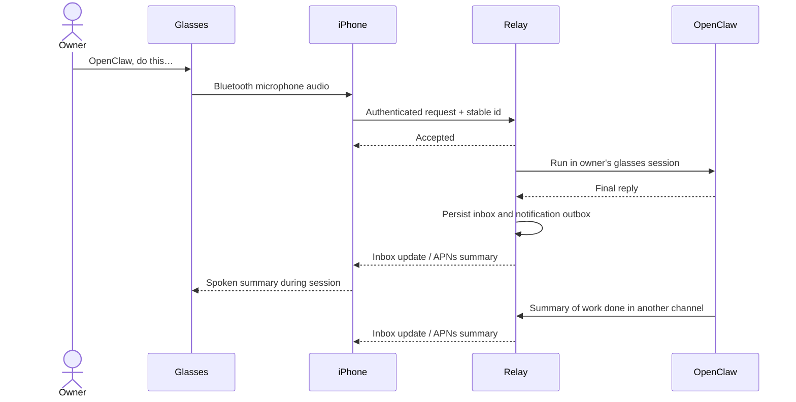

# Glasses backend for My Claw

One new backend for the Glasses feature in the existing
[My Claw iPhone app](../openclaw-iphone/README.md). The iPhone app includes voice
requests, spoken replies, and completion summaries alongside its existing chat,
location, website, phone and connection features. There is one app target and
one App Store identity; this folder contains the relay and tenant integration.

The fleet backend is live at **https://glasses.fusenv.com**. Remaining setup is tracked in
[todo-meta-glasses.md](../todo-meta-glasses.md). The
[operations runbook](deploy/README.md) covers deployment and daily backups.

This implementation targets **iOS 17+ with paired Bluetooth HFP glasses**. It
uses the existing 8examples login, a fleet-hosted relay, and Apple speech/audio
APIs. Meta documents microphone/speaker access through the paired phone's
Bluetooth profiles. Camera and display access are outside this integration,
so no Meta Device Access Toolkit binary is needed for this audio path.
[Meta's supported access paths](https://developers.meta.com/wearables/faq/).

## Use it

1. Pair the glasses in the Meta AI app and iPhone Bluetooth settings.
2. Sign into your existing My Claw app, open **Glasses**, and set the relay's HTTPS
   address under **Connection settings** if it has not been configured already.
   Glasses automatically uses that login and the app's assistant picker.
3. Select your glasses microphone, then start a listening session.
4. Say **“OpenClaw, …”** followed by your request. A pause sends it. New replies
   are stored in the inbox and read through the glasses during the session.
5. Say “OpenClaw, stop listening” to finish. Enable notifications to receive
   summaries on your iPhone outside a session.

Sessions are explicitly started and limited to 15 minutes. Recognition pauses
while speaking so the app cannot hear its own reply as a new command. The app
stops on disconnection or audio interruption. The phone microphone is a separate,
explicit testing option.

**“Hey Meta” still invokes Meta.** This app does not replace that wake phrase,
launch itself from the glasses, or remotely activate the microphone. An active
session may continue with the phone locked, subject to iOS audio and speech
recognition availability; test this with your device. While the app is suspended
or terminated, APNs delivers an iPhone notification. Automatic spoken glasses
announcements outside a session are not guaranteed by this app.

## Components

| Path | Purpose |
| --- | --- |
| `../openclaw-iphone/ios/` | The existing SwiftUI app, including the Glasses tab, shared login, audio, inbox and APNs registration |
| `server/` | Authenticated relay, SQLite queue/inbox/outbox, OpenClaw runner, APNs provider |
| `integration/` | Tenant setup, credential-handling summary helper, agent instructions |
| `test/` | Account isolation, execution recovery, idempotency, and notification tests |



## Relay setup

Run on the fleet host with Node 22.18+ and Docker access to its
`openclaw-<tenant>` containers:

```bash
cd openclaw-meta-glasses
npm ci
node integration/configure.mjs openclaw1
npm start
```

The configuration command creates ignored, private `.env` and `config.local.json`
files containing a random encryption key and per-claw publisher credential.
Repeated runs preserve existing keys. Run it with another tenant id to add that
tenant. Back up the encryption key with the database; do not commit these files.

The relay listens on `127.0.0.1:8795`. Configure an HTTPS reverse proxy using
your actual DNS name, then use that HTTPS origin in the app. Example Caddy entry:

```caddyfile
glasses.your-domain.example {
    reverse_proxy 127.0.0.1:8795
}
```

Docker alternative, after configuration:

```bash
mkdir -p data secrets
docker compose up -d --build
```

The service binds to host loopback. The Docker socket gives administrative access
and stays on the fleet host; it is never exposed to app clients. Run **one relay
process per database**. Requests, summaries, and push retries persist in `data/`.
The worker calls `openclaw agent --json` without `--deliver` in a separate
`glasses:<claw>:<owner>` session. The relay delivers its final response.

## Summaries from other channels

After configuring the relay's real HTTPS address, run on the fleet host:

```bash
cd openclaw-meta-glasses
node integration/connect-tenant.mjs /absolute/path/to/tenants/openclaw1 https://glasses.your-domain.example
cd ..
npm run cli -- enable openclaw1 glasses
```

The first command adds only the two glasses environment variables to the existing
tenant `.env`. The normal `enable` command installs `capabilities/glasses.md`
and `glasses/publish-summary.mjs`, updates the agent instructions, and restarts
that tenant with the new environment. The capability is **opt-in** and preserves
agent-owned pending summaries and history.

After meaningful work completed through Telegram, calls, or scheduled tasks, the
agent writes `glasses/summary.json` and runs:

```bash
node glasses/publish-summary.mjs glasses/summary.json
```

Example body, using verified outcomes and a stable id for the task:

```json
{
  "actionId": "booking-20260905-001",
  "clawId": "openclaw1",
  "summary": "Your table for two is confirmed for 7 pm. The confirmation is saved.",
  "detail": "Optional supporting details, up to 8000 characters."
}
```

Summaries are limited to 400 characters. The helper supplies credentials from
the environment. Reusing an action id with identical content returns the same
inbox event. Acceptance does not prove the owner heard it. Never repeat the
underlying action because summary delivery failed. Glasses requests already
receive automatic final-reply delivery and must not publish a duplicate summary.

## Build the existing iPhone app

On a Mac with Xcode, use the existing project:

```bash
cd ../openclaw-iphone
xcodebuild -project ios/OpenClaw.xcodeproj -scheme OpenClaw \
  -sdk iphonesimulator -destination 'generic/platform=iOS Simulator' \
  CODE_SIGNING_ALLOWED=NO build
```

Open `ios/OpenClaw.xcodeproj` and build/install the existing app. Its bundle id
remains `ai-assistant.8examples.com`, with the existing signing team and app icon.
Set `OPENCLAW_GLASSES_RELAY_URL` in the existing `Info.plist` or use the Glasses
connection settings. Glasses receives the main app's existing session token in
memory and uses its Keychain service for pending requests; it has no separate
login, password screen, or stored login token. Signing out in the app stops
listening, disconnects push and revokes the shared account session.

For remote notifications, enable Push Notifications for the App ID, use its
matching provisioning profile, put your APNs `.p8` key in `secrets/`, and set:

```dotenv
APNS_KEY_FILE=/app/secrets/AuthKey.p8
APNS_KEY_ID=YOUR_KEY_ID
APNS_TEAM_ID=YOUR_TEAM_ID
APNS_TOPIC=ai-assistant.8examples.com
APNS_ENVIRONMENT=sandbox
```

Use a local key path outside Docker. Debug device builds use `sandbox`;
TestFlight/release builds use `production`. Restart the relay, then enable
“Notify me when work is done” in the app. The app supplies its actual APNs token.
[Apple registration](https://developer.apple.com/documentation/usernotifications/registering-your-app-with-apns),
[Apple notification requests](https://developer.apple.com/documentation/usernotifications/sending-notification-requests-to-apns).

Push retries are independent of tasks, use backoff, and expire after 24 hours.
Ownership is rechecked before each push; revoked sessions and invalid devices
are removed. A failed push does not erase its inbox event or repeat any work.
Signing out disconnects the subscription. Tokens never enter push payloads.

## API and execution behavior

| Endpoint | Credential | Behavior |
| --- | --- | --- |
| `GET /health` | None | Local health check |
| `GET /v1/me` | Existing `mob_` session | Owned claws and push availability |
| `POST /v1/requests` | `mob_` session | `{requestId,clawId,text}` → 202; same id/content returns existing state |
| `GET /v1/events?clawId=…&after=…` | `mob_` session | Ordered summaries and cursor; omit `after` for recent history |
| `POST /v1/devices` | `mob_` session | `{installationId,deviceToken}` → subscribe this iPhone |
| `DELETE /v1/devices/:id` | `mob_` session | Disconnect this owner's device |
| `POST /v1/summaries` | Per-claw `gws_` publisher | `{actionId,clawId,summary,detail?}` → durable summary |

The existing `/api/mobile/queries/me` endpoint verifies account sessions.
Ownership is enforced for every request/read and rechecked before work starts.
Stored session tokens are encrypted with AES-256-GCM.

Requests are durably claimed before running. Restarting turns previously running
requests into `uncertain`, without executing them again. Timeouts and malformed
agent results also become `uncertain`: an action may already have happened.
Transport retries retain the original request id. This prevents duplicate
execution by this relay, but cannot guarantee exactly-once effects in external
services used by OpenClaw.

## Validation

```bash
npm test
npm run check
cd ..
npm run typecheck
npm test
```

Relay tests use real HTTP handlers and SQLite with fake agent and push adapters;
they cannot call or message anyone. They cover account isolation, duplicate ids,
crash recovery, session revocation, unsubscribe, and notification retries.

Run `OpenClawTests` through the existing `OpenClaw` scheme on an available iPhone
simulator in Xcode. These include shared-session, assistant-selection, logout,
request-retry, and speech tests. Before relying
on the glasses, verify microphone selection, addressed speech, reply audio,
locked-phone behavior, interruption/disconnection, and an actual APNs push on
your paired device. This implementation environment had no Xcode/iOS SDK or
paired hardware, so those native checks remain. Adding the code does not deploy
the relay, install the app, configure push credentials, or enable any live tenant.
